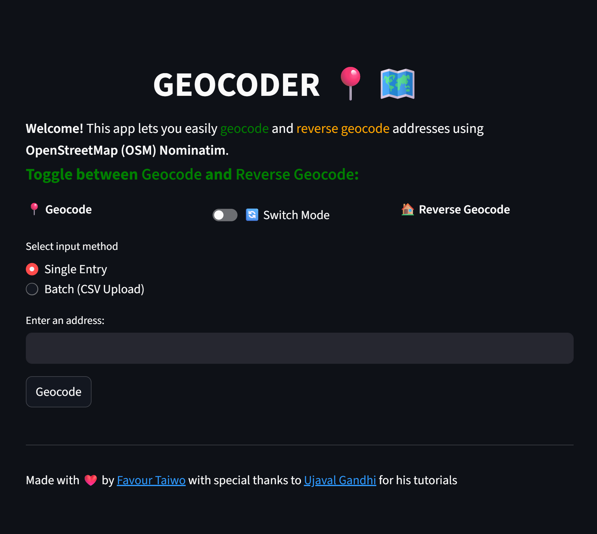

# GEOCODER 📍🗺️

A user-friendly web application for geocoding and reverse geocoding using OpenStreetMap (OSM) Nominatim, built with Streamlit, Geopy, and Folium.

## Features
- **Geocode**: Convert addresses to latitude and longitude (single or batch mode)
- **Reverse Geocode**: Convert coordinates to addresses (single or batch mode)
- **Interactive Map**: Visualize results on a map using Folium
- **CSV Upload/Download**: Batch process and export results
- **Simple UI**: Toggle easily between geocoding and reverse geocoding

## Demo

## Usage
- **Geocode**: Enter an address or upload a CSV with addresses. Download results as CSV.
- **Reverse Geocode**: Enter coordinates or upload a CSV with latitude and longitude columns. Download results as CSV.
- **Map**: View geocoded or reverse geocoded results on an interactive map.

## Notes
- The app uses OSM Nominatim, which limits requests to 1 per second. Please be patient with batch operations.
- Your data is processed locally and not stored.

## Acknowledgements
- [Streamlit](https://streamlit.io/)
- [Geopy](https://geopy.readthedocs.io/)
- [Folium](https://python-visualization.github.io/folium/)
- [OpenStreetMap Nominatim](https://nominatim.openstreetmap.org/)

## Author
Made with ❤️ by [Favour Taiwo](https://github.com/favtai)
"# Geocoder" 
